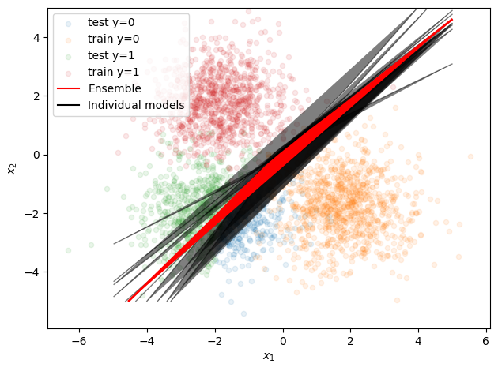

## CS229 HW3 Report

### (a) Describe architecture and hyper-parameter choices (2 points)

- The architecture of each individual model consists of an input layer that matches the number of features in the data, a hidden layer with 50 units, and an output layer with a number of units corresponding to the number of classes (2 in this case). The activation function used in the hidden layer is ReLU (Rectified Linear Unit), and LogSoftmax activation is used in the output layer.
- The ensemble model is a simple ensemble that averages the outputs of the individual models.
- For the training process, the Adam optimizer is used with its default parameters (learning rate of 0.001, beta1=0.9, beta2=0.999). The number of training epochs is set to 10.
- The training data are used as-is without any preprocessing steps. It's loaded into a DataLoader, which shuffles the instances and splits them into mini-batches of size 100.

### (b) Visualize (3 points)

### (c) Calculate (3 point)

|                     | Mean across models | Ensemble model |
| :------------------ | :----------------: | :------------: |
| Train accuracy      |       0.994        |     0.993      |
| Validation accuracy |       0.993        |     0.993      |
| Test accuracy       |       0.821        |     0.855      |
| Train ECE           |       0.031        |     0.030      |
| Validation ECE      |       0.033        |     0.032      |
| Test ECE            |       0.094        |     0.088      |

### (d) Discuss (2 points)

The ensemble model exhibits performance characteristics that are consistent with the expectations of ensemble methods. Ensemble models are often more robust and generalize better compared to individual models, and this can be especially valuable when dealing with covariate shifts.

From the results, the accuracy of the ensemble model on the train and validation datasets is comparable to the mean accuracy across the individual models. This is expected since the ensemble model averages the predictions from the individual models, thereby helping to mitigate overfitting and improving generalization.

When we shift to the test dataset, which may represent a covariate shift, the ensemble model demonstrates its strength. It achieves higher accuracy compared to the mean accuracy of individual models, suggesting that it generalizes better to unseen data.

The Expected Calibration Error (ECE) of the ensemble model is slightly lower compared to the mean ECE of the individual models across all datasets. This shows that the ensemble model tends to be better calibrated, meaning that its predicted probabilities are closer to the true probabilities. This could be attributed to the ensemble's ability to smooth out individual models' errors, leading to more confident and accurate predictions.

However, we should note that the ECE on the test dataset is higher than the train and validation datasets for both ensemble and individual models. This indicates that both the ensemble and individual models are less well-calibrated on the test data, which may be due to the potential covariate shift.

Overall, these results provide evidence that ensembling helps improve the performance and robustness of the model, especially under conditions where the test data may not follow exactly the same distribution as the training data.
